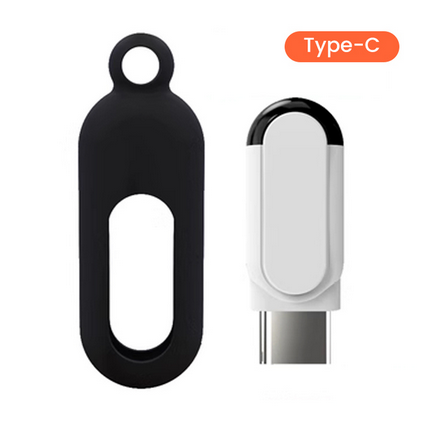
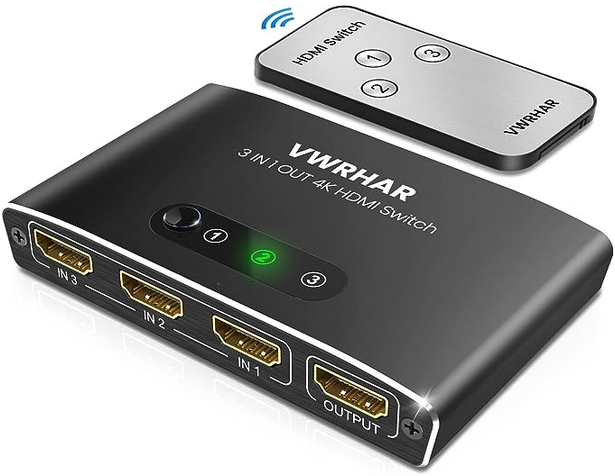

# TiqiaaUsb-cli

Simple cli to send IR commands using a TiqiaaUsb device.

## Why

I needed an HDMI switch for one of my computer screens. I wanted one with a
remote control so I bought this one [from Amazon](https://www.amazon.es/dp/B09MM5QT3R):

The switch uses a simple IR remote control. I wanted to be able to control the
switch from my computer so I bought a USB IR transceiver
[from aliexpress](https://pt.aliexpress.com/item/1005005468033633.html):

The problem began when I did not want to use the mobile app that came with the
device.

For this HDMI switch, the NEC IR codes are:

- First output = 0x8002;
- Second output = 0x8004;
- Third output = 0x8006;

## Credits

I didn't write most of the stuff on this repository (specially the driver).
Sources and useful links:

- [Initial discussing I saw](https://github.com/irplus-remote/irplus-codes.github.io/issues/452)
- [Original reverse engineer forum post](https://habr.com/ru/post/494800/)
- [Application and driver for Windows](https://gitlab.com/XenRE/tiqiaa-usb-ir)
- [Python code for the driver](https://gitlab.com/normanr/tiqiaa-usb-ir-py)
- [LibUSB port to Linux](https://gitlab.com/XenRE/tiqiaa-usb-ir/-/tree/b0731b48020b10114466a511fbcf3a862349af28/Src)

Thanks to all these people for their work.

## Dependencies/Thanks

- [CLI11](https://github.com/CLIUtils/CLI11)
- [Makefile template](https://github.com/TheNetAdmin/Makefile-Templates/blob/master/SmallProject/Template/Makefile)
